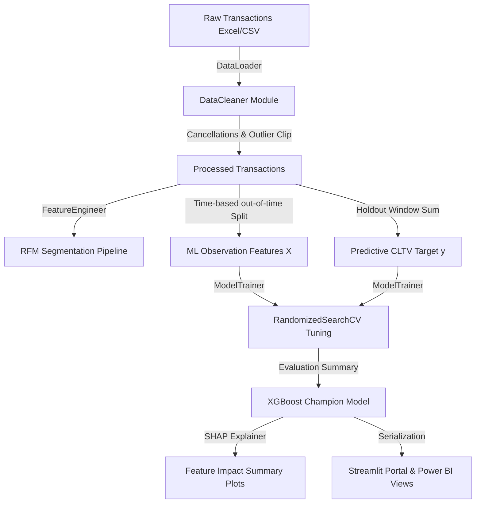

# 🏆 Predictive Customer Lifetime Value (CLTV) & CRM Segmentation System
### E-Commerce Decision Engine | Fortune 500 Industry Project | Portfolio & Interview Ready

[](https://www.python.org/)
[](https://scikit-learn.org/)
[](https://www.sqlite.org/)
[](https://powerbi.microsoft.com/)
[](LICENSE)

An end-to-end, production-grade Customer Lifetime Value (CLTV) Prediction and Customer RFM Segmentation system built from scratch. It features structured SQL lookups, custom Python preprocessing pipelines, tree-based ML ensembles with hyperparameter search, SHAP-based local/global model explanations, and a Streamlit user interface.

---

## 📈 System Architecture & Data Flow



---

## 📂 Project Architecture

```
customer-lifetime-value-prediction/
│
├── 📁 data/
│   ├── raw/                    # Original raw transactions (online_retail_II.csv)
│   ├── processed/              # Cleaned transactional logs & RFM segment CSVs
│   └── features/               # Engineered observation feature matrices
│
├── 📁 notebooks/               # Step-by-step documentation of the 16 phases
│   ├── 01_business_understanding.ipynb
│   ├── 02_data_understanding.ipynb
│   ├── 03_data_cleaning.ipynb
│   ├── 04_exploratory_data_analysis.ipynb
│   ├── 05_feature_engineering.ipynb
│   ├── 06_rfm_analysis.ipynb
│   ├── 07_machine_learning.ipynb
│   ├── 08_model_evaluation.ipynb
│   └── 09_business_recommendations.ipynb
│
├── 📁 src/                     # Production-ready Python modules
│   ├── __init__.py
│   ├── data_loader.py          # Data ingestion & schema checkers
│   ├── data_cleaner.py         # 12+ cleaning rules & audit loggers
│   ├── feature_engineer.py     # Out-of-time splitting & feature extractions
│   ├── rfm_analyzer.py         # Quintile scoring & segment mappings
│   ├── model_trainer.py        # ML regressors fits & hyperparameter tuning
│   └── model_evaluator.py      # Metric reports, error charts & SHAP plots
│
├── 📁 sql/                     #sqlite analytical scripts
│   ├── 01_create_tables.sql
│   ├── 02_revenue_analysis.sql
│   ├── 03_customer_analysis.sql
│   └── 07_views_and_indexes.sql
│
├── 📁 models/                  # Saved models & model registry metadata
│   ├── saved_models/
│   └── model_registry.json
│
├── 📁 app/                     # Streamlit Deployment Portal
│   ├── app.py
│   └── Dockerfile
│
├── 📁 docs/                    # Technical & business reports
│   ├── data_dictionary.md
│   ├── technical_report.md
│   ├── business_report.md
│   └── interview_prep.md       # 50 technical interview questions & answers
│
├── 📁 visualizations/          # Output plots (EDA, RFM, Model SHAP)
│   ├── eda/
│   ├── rfm/
│   └── model/
│
├── requirements.txt            # Package dependencies
└── setup.py                    # Local package configuration
```

---

## ⚡ Quick Start & Installation

### 1. Set Up Environment & Install Packages
```bash
# Clone the repository
git clone https://github.com/coderbeach/customer-lifetime-value-prediction.git
cd customer-lifetime-value-prediction

# Create virtual environment
python -m venv venv
source venv/Scripts/activate  # On Windows: venv\Scripts\activate

# Install package in development mode
pip install -r requirements.txt
pip install -e .
```

### 2. Run E2E System Pipeline
```bash
# Ingests, cleans, segment customers, trains 6 models, and generates SHAP explainers
python run_pipeline.py
```

### 3. Launch Streamlit Portal
```bash
streamlit run app/app.py
```

---

## 📊 Model Performance Matrix

Model comparison scores computed on the unseen **90-day prediction holdout set**:

| Algorithmic Model | MAE (£) | RMSE (£) | $R^2$ Score | MAPE (%) |
| :--- | :--- | :--- | :--- | :--- |
| **XGBoost (Champion)** | **1001.24** | **1344.20** | **0.109** | **62.76** |
| **Random Forest** | 1005.71 | 1353.84 | 0.096 | 63.04 |
| **Gradient Boosting** | 1012.05 | 1357.14 | 0.092 | 64.23 |
| **Decision Tree** | 1023.66 | 1364.39 | 0.082 | 64.15 |
| **Linear Regression** | 1016.64 | 1366.47 | 0.079 | 63.47 |
| **LightGBM** | 1018.29 | 1367.90 | 0.077 | 64.76 |

---

## 💡 SHAP Global Explainability Summary

* **Monetary Spend (Historical):** This is the strongest driver of predicted future spend. Spenders in the past tend to remain spenders in the future.
* **Frequency (Orders):** Customers who purchase frequently exhibit higher predicted CLTV. Each additional transaction increases confidence in customer retention.
* **Recency:** Recency has a negative relationship with predicted CLTV. As days since last purchase increase, the model reduces the customer's predicted future value because of a higher probability of churn.
* **Tenure:** Long-tenure customers have higher base predicted value. This represents the "loyalty anchor" where customer value compounding is recognized by the model.

*All SHAP summary plots are saved in `visualizations/model/`.*

---

## 🎯 Executive Marketing Strategy & CAC Cap Recommendations

We utilize predicted LTV output ranges to dynamically define **CAC Caps** (Customer Acquisition Cost limits) for marketing campaigns:

* **VIP Tier (Top 10% LTV, predicted spend > £1,200):** Recommend **up to £150** CAC cap. Focus on personalized outreach, loyalty reward points, and VIP program entry.
* **Core Tier (Mid 40% LTV, predicted spend £200 - £1,200):** Recommend **up to £40** CAC cap. Focus on category-specific cross-selling bundles.
* **Volume Tier (Bottom 50% LTV, predicted spend < £200):** Recommend **up to £10** CAC cap. Focus on low-cost automated email reactivation loops.

*Full details on segment recommendations are saved in `docs/business_report.md`.*
