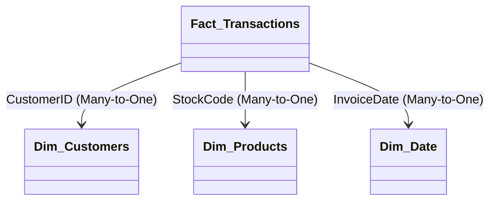

# 📊 Power BI DAX Measures & Data Model Guide

This document lists all professional DAX measures and the data modeling configuration required to build the CLTV dashboard in Power BI.

---

## 🔗 Data Model Schema (Star Schema)

For production-grade reporting, organize the tables in a **Star Schema** within the Power BI Model View:



1. **Fact_Transactions** (from `cleaned_retail.csv` or database view `v_transactions`)
2. **Dim_Customers** (from `v_customer_summary` joined with `rfm_segments.csv`)
3. **Dim_Products** (from `v_product_summary`)
4. **Dim_Date** (Power BI Date table generated via CALENDARAUTO())

---

## 📐 Core DAX Measures

Create a dedicated blank table named `_Measures` in Power BI to house these expressions:

### 1. Total Net Sales (Revenue)
```dax
Total Net Sales = SUM(Fact_Transactions[Revenue])
```
*Description: Sum of transaction line values (Quantity * Price) after cleaning adjustments.*

### 2. Unique Customers Count
```dax
Total Unique Customers = DISTINCTCOUNT(Fact_Transactions[CustomerID])
```
*Description: Active buyers count in the selected period.*

### 3. Total Transaction Count (Orders)
```dax
Total Orders = DISTINCTCOUNT(Fact_Transactions[Invoice])
```
*Description: Number of unique invoice documents generated.*

### 4. Average Order Value (AOV)
```dax
Average Order Value (AOV) = DIVIDE([Total Net Sales], [Total Orders], 0)
```
*Description: Average amount spent per purchase invoice.*

### 5. Purchase Frequency
```dax
Purchase Frequency = DIVIDE([Total Orders], [Total Unique Customers], 0)
```
*Description: Average number of transactions per customer.*

### 6. Customer Acquisition Cost (CAC) — Constant Assumption
```dax
Assumed CAC = 45.00
```
*Description: Baseline placeholder for marketing acquisition cost per customer (in £).*

### 7. Total Predicted CLTV (90-day Holdout Forecast)
```dax
Total Predicted CLTV = SUM(Dim_Customers[predicted_cltv])
```
*Description: Sum of forecasted next-90-day purchase values across the customer base.*

### 8. Average Predicted CLTV
```dax
Avg Predicted CLTV = AVERAGE(Dim_Customers[predicted_cltv])
```
*Description: Mean predicted 90-day customer value.*

### 9. LTV to CAC Ratio
```dax
LTV to CAC Ratio = DIVIDE([Avg Predicted CLTV], [Assumed CAC], 0)
```
*Description: Measures marketing acquisition efficiency. Target is > 3.0.*

### 10. Repeat Purchase Rate (RPR%)
```dax
Repeat Purchase Rate % = 
VAR CustomersWithMultipleOrders = 
    COUNTROWS(
        FILTER(
            ADDCOLUMNS(
                VALUES(Fact_Transactions[CustomerID]),
                "@OrderCount", [Total Orders]
            ),
            [@OrderCount] > 1
        )
    )
RETURN
    DIVIDE(CustomersWithMultipleOrders, [Total Unique Customers], 0)
```
*Description: Percentage of active customer base that has purchased more than once.*

### 11. Customer Churn Rate %
```dax
Customer Churn Rate % = 
VAR InactiveCustomers = 
    COUNTROWS(
        FILTER(
            Dim_Customers,
            Dim_Customers[DaysSinceLastPurchase] > 90
        )
    )
VAR TotalCust = COUNTROWS(Dim_Customers)
RETURN
    DIVIDE(InactiveCustomers, TotalCust, 0)
```
*Description: Proportion of customers whose last purchase was more than 90 days ago.*
